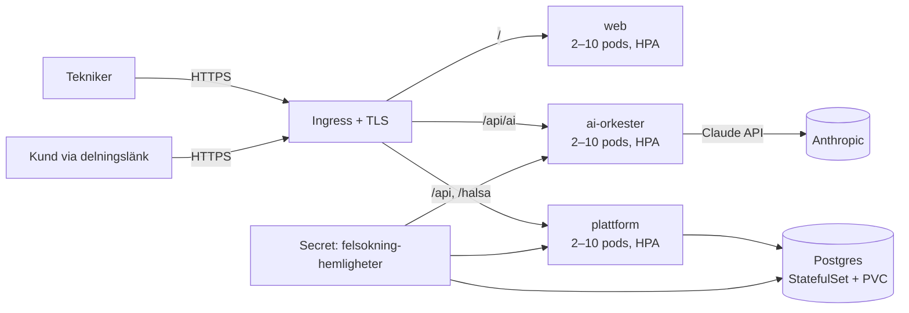
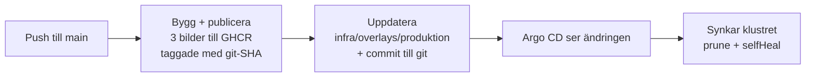

# Guidad Felsökning – Drift i Kubernetes (helt självhostat)

Målarkitekturen ur [Master Prompt](MASTER-PROMPT.md) som kod: hela stacken körbar i eget kluster — webb, AI-orkester, plattformsbackend (auth + händelse-API + Live Share) och Postgres. Inga externa tjänstberoenden utöver Anthropic-API:et för AI-anropen.

## Arkitektur



| Komponent | Vad | Var |
| --- | --- | --- |
| `web` | SPA:n bakom oprivilegierad nginx (`Dockerfile`, `docker/nginx.conf`) | Deployment + Service + HPA + PDB |
| `plattform` | Självhostad backend (`services/plattform`): **multi-tenant** — registrering skapar organisation + systemadministratör, admin hanterar användare (tekniker/arbetsledare/admin), all ärendedata organisationsisolerad. Inloggning (bcrypt via pgcrypto, HS256-JWT med roll + org i anspråken), append-only händelse-API, publik delningsendpoint | Deployment + Service + HPA + PDB |
| `ai-orkester` | AI-orkestern (`services/ai-orkester`): fyra uppgifter routade till Sonnet 5 / Opus 5 / Haiku 4.5 — verifierar plattformens JWT (delad hemlighet) | Deployment + Service + HPA + PDB |
| `postgres` | Händelselogg + användare; **append-only garanterat med databastriggers** — historik kan inte ändras eller raderas oavsett roll | StatefulSet + PVC (10 Gi). Produktion: CloudNativePG-operatorn för backup/failover/PITR |
| Hemligheter | `anthropic-api-key`, `jwt-secret` (delas av plattform + orkester), `postgres-losenord`, `integration-nyckel` (krypterar kundernas märkesspecifika credentials) |
| Miljöflaggor | `TILLATNA_URSPRUNG` (CORS-lista; utelämnad = `*`), `TILLAT_INTERNA_UPPSLAG` (`true` tillåter leverantörsuppslag mot privata nät), `REGISTRERING_OPPEN`, `ECM_REGLER_FIL`, `INTEGRATIONER_FIL` | Secret `felsokning-hemligheter` — aldrig i bilder eller manifest |

**Klienten har två driftlägen**, valda vid bygget: med `VITE_PLATTFORM_URL` går inloggning, synk, Live Share och AI mot klustret (helt självhostat); utan den används Supabase-läget (edge-funktion + managerad Postgres/Auth) som tidigare. Samma händelsemodell, samma orkester — låst av paritetstester.

## Infrastrukturen som kod

`infra/terraform` är systemets definition — läs [README:n där](../infra/terraform/README.md).
Börja i `karta.tf`: hela systemet beskrivet en gång som data (tjänster,
portar, routing, hemligheter, dataflöden, gränser). `terraform output
karta` skriver ut samma sak i klartext.

`infra/k8s` + `infra/overlays` + `infra/gitops` beskriver samma system i
kustomize, synkat av Argo CD. **Kör inte båda mot samma kluster** — Argo
CD:s `selfHeal` återställer det Terraform ändrar och `prune` tar bort det
Terraform skapar. Terraform-vägen har dessutom nätverkspolicyer och
säkerhetskontext på databasen, vilket kustomize-vägen saknar.

## Nätverksgränser

Terraform-vägen stänger namnrymden och öppnar bara de faktiska flödena:

| Från | Till | Varför |
| --- | --- | --- |
| ingress-kontrollern | web, plattform, ai-orkester :8080 | den enda vägen in |
| plattform | postgres :5432 | händelseloggen |
| plattform | internet :443 utom privata nät | kundernas leverantörer |
| ai-orkester | internet :443 utom privata nät | Claude |
| web, postgres | — | ringer ingenting |

Undantagen för privata nät (10/8, 172.16/12, 192.168/16, 169.254/16,
127/8, 100.64/10) är samma gräns som koden själv upprätthåller i
`pekarInat` — två oberoende spärrar mot att ett kundkonfigurerat uppslag
används för att nå klustrets insida eller molnets metadatatjänst.
Kräver en CNI som tillämpar NetworkPolicy; annars är reglerna
dokumentation, inte skydd.

## Driftsätta

```sh
# 1. Bygg och publicera bilderna (ersätt registry i infra/k8s/*.yaml)
docker build -t ghcr.io/ORG/guidad-felsokning-web \
  --build-arg VITE_PLATTFORM_URL=https://app.exempel.se .
docker build -t ghcr.io/ORG/guidad-felsokning-ai-orkester services/ai-orkester
docker build -t ghcr.io/ORG/guidad-felsokning-plattform services/plattform
docker push ghcr.io/ORG/guidad-felsokning-web
docker push ghcr.io/ORG/guidad-felsokning-ai-orkester
docker push ghcr.io/ORG/guidad-felsokning-plattform

# 2. Skapa secret:en (eller använd External Secrets/Sealed Secrets)
kubectl create namespace guidad-felsokning
kubectl -n guidad-felsokning create secret generic felsokning-hemligheter \
  --from-literal=anthropic-api-key='sk-ant-…' \
  --from-literal=jwt-secret="$(openssl rand -base64 48)" \
  --from-literal=postgres-losenord="$(openssl rand -base64 24)" \
  --from-literal=integration-nyckel="$(openssl rand -hex 32)"

# 3. Applicera manifesten (Postgres initieras med schema + append-only-triggers)
kubectl apply -k infra/k8s

# 4. Verifiera
kubectl -n guidad-felsokning get pods
curl https://app.exempel.se/halsa            # → {"status":"ok"} (plattformen)
curl https://app.exempel.se/api/openapi.yaml # API-first: hela API-specen
```

Med Terraform i stället: `cd infra/terraform && terraform apply -var bildtagg=<git-sha>`.

Byt domän och cert-issuer i `infra/k8s/ingress.yaml` (eller `var.doman` i Terraform). Att skapa nya organisationer är öppet i beta — stäng med `REGISTRERING_OPPEN=false` på plattformens Deployment; användare inom en organisation skapas alltid av dess systemadministratör.

## Märkesspecifika kopplingar

Varje verkstad har sina egna avtal med tillverkare och dataleverantörer.
Kopplingarna konfigureras därför av kunden själv under **Inställningar →
Märkesspecifika kopplingar**: systemadministratören väljer leverantör och
fyller i sina credentials.

* **Uppgifterna når aldrig webbläsaren.** De krypteras med AES-256-GCM
  (`INTEGRATION_NYCKEL`, 32 byte hex eller base64) innan de skrivs till
  tabellen `integrationer`, och API:t returnerar hemliga fält maskerade
  (`••••3456`). Alla uppslag mot leverantören görs av servern.
* **Fail closed.** Saknas `INTEGRATION_NYCKEL` sparas ingenting — API:t
  svarar 503 och inställningssidan säger varför. Inga uppgifter hamnar
  någonsin i klartext.
* **Leverantörer är data, inte kod.** Registret ligger i
  `services/plattform/integrationer.json` och kan bytas mot en
  ConfigMap-mount via `INTEGRATIONER_FIL`. Nya märken läggs till genom
  att beskriva URL-mall, autentiseringstyp och svarsmappning — ingen
  ombyggnad av applikationen krävs.
* **Testresultat loggas på kopplingen.** Varje uppslag skriver
  `senast_testad` och `senaste_status`, så ett trasigt abonnemang syns i
  inställningarna i stället för att tyst ge tomma svar.

## Multi-tenant och roller

Enligt Master Prompt: varje kund är en egen tenant, ingen data blandas mellan kunder.

- **Registrering skapar organisationen** och gör användaren till systemadministratör.
- **Admin skapar användare** (tekniker/arbetsledare/admin) i sin organisation — via UI:t eller `POST /api/anvandare`.
- **All ärendedata är organisationsknuten**: ärenden skapas i användarens organisation och händelse-API:t verifierar organisationstillhörighet på varje anrop — en annan organisations ärenden ger 404.
- **Rollen ligger i JWT:n** och verifieras på servern; klienten anpassar bara UI:t.

Integrationstestet (`services/plattform/integrationstest.sh`, körs även i CI mot riktig Postgres) verifierar hela kedjan: registrering, synk, idempotens, append-only-triggern, organisationsisolering, delningsfiltrering och rollstyrning.

## Säkerhet och robusthet

- **Append-only i tre lager:** klienten lägger bara till, API:t exponerar inga update/delete, och databastriggers avvisar ändringar även för en felkonfigurerad roll.
- **JWT-flödet är verifierat tvärs tjänsterna:** plattformen signerar, orkestern verifierar samma hemlighet; fel hemlighet och utgångna tokens avvisas (testat).
- Alla containrar kör **non-root** utan capabilities; backend-tjänsterna med read-only rotfilsystem. Båda failar closed utan sina hemligheter.
- **HPA** 2–10 pods per tjänst på 70 % CPU; **PDB** minst en pod uppe vid noddränering; readiness/liveness-prober överallt (`pg_isready` för Postgres).

## CI/CD med GitOps

**CI** (`.github/workflows/ci.yml`): tester, produktionsbygge, integrationstest mot riktig Postgres och verifierande containerbyggen på varje push/PR.

**CD** (`.github/workflows/publicera.yml` + Argo CD): klustret följer git — ingen CI-process har kubectl-åtkomst.



1. Varje main-push bygger de tre bilderna, publicerar till GHCR (`GITHUB_TOKEN`, inga externa hemligheter) och uppdaterar produktions-overlayens taggar med `kustomize edit set image` — overlayen ombyggs som verifiering innan commiten.
2. **Argo CD är enda vägen in i klustret.** Bootstrap en gång: installera Argo CD, ersätt repo-URL:en i `infra/gitops/argocd-application.yaml` och `kubectl apply -f` den. Därefter: `prune` tar bort det som försvinner ur git, `selfHeal` återställer manuella klusteravvikelser.
3. **Rollback = `git revert`** av gitops-commiten — Argo CD synkar tillbaka föregående SHA-taggade bilder.
4. Repo-variabeln `PLATTFORM_URL` (Settings → Variables) styr webbyggets `VITE_PLATTFORM_URL`/`VITE_AI_ORKESTER_URL`. Hemligheten `felsokning-hemligheter` ligger utanför både git och synken.

Manuell `kubectl apply -k infra/k8s` (avsnittet Driftsätta ovan) fungerar fortfarande för miljöer utan Argo CD.
