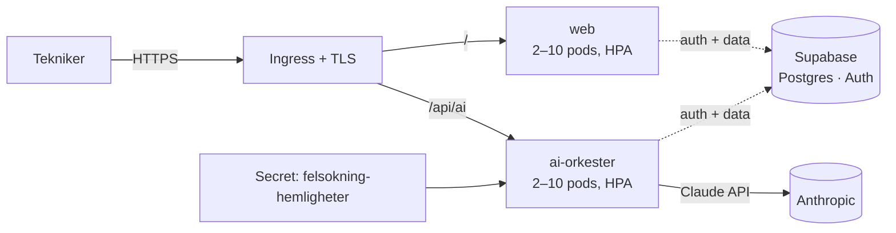

# Guidad Felsökning – Drift i Kubernetes

Målarkitekturen ur [Master Prompt](MASTER-PROMPT.md) som kod: allt körbart i kluster, med secrets för plattformsnycklarna och CI som verifierar både kod och containerbyggen.

## Arkitektur



| Komponent | Vad | Var |
| --- | --- | --- |
| `web` | SPA:n bakom oprivilegierad nginx (`Dockerfile`, `docker/nginx.conf`) | Deployment + Service + HPA + PDB |
| `ai-orkester` | AI-orkestern som egen tjänst (`services/ai-orkester`) — samma routing som edge-funktionen, med egen JWT-verifiering och `/halsa` | Deployment + Service + HPA + PDB |
| Hemligheter | `ANTHROPIC_API_KEY` + `SUPABASE_JWT_SECRET` | Secret `felsokning-hemligheter` — aldrig i bilder eller manifest |
| Databas & auth | Postgres (händelselogg, RLS, `hamta_delat_arende`) och inloggning | Supabase — managerad, eller självhostad Supabase i klustret när det steget tas |

Klienten väljer AI-väg vid byggtillfället: med `VITE_AI_ORKESTER_URL` satt går anropen till orkestertjänsten i klustret; utan den används Supabase-edge-funktionen. Samma orkester (modeller, systemprompter, scheman) i båda.

## Driftsätta

```sh
# 1. Bygg och publicera bilderna (ersätt registry i infra/k8s/*.yaml)
docker build -t ghcr.io/ORG/guidad-felsokning-web \
  --build-arg VITE_SUPABASE_URL=… \
  --build-arg VITE_SUPABASE_PUBLISHABLE_KEY=… \
  --build-arg VITE_SUPABASE_PROJECT_ID=… \
  --build-arg VITE_AI_ORKESTER_URL=https://app.exempel.se .
docker build -t ghcr.io/ORG/guidad-felsokning-ai-orkester services/ai-orkester
docker push ghcr.io/ORG/guidad-felsokning-web
docker push ghcr.io/ORG/guidad-felsokning-ai-orkester

# 2. Skapa secret:en (eller använd External Secrets/Sealed Secrets)
kubectl create namespace guidad-felsokning
kubectl -n guidad-felsokning create secret generic felsokning-hemligheter \
  --from-literal=anthropic-api-key='sk-ant-…' \
  --from-literal=supabase-jwt-secret='…'

# 3. Applicera manifesten
kubectl apply -k infra/k8s

# 4. Verifiera
kubectl -n guidad-felsokning get pods
curl https://app.exempel.se/halsa   # → {"status":"ok"}
```

Byt domän och cert-issuer i `infra/k8s/ingress.yaml`.

## Skalning och robusthet

- **HPA** 2–10 pods per tjänst på 70 % CPU; **PDB** håller minst en pod uppe vid noddränering.
- Båda containrarna kör **non-root** utan capabilities; orkestern dessutom med read-only rotfilsystem.
- **Hälsokontroller**: nginx svarar på `/`, orkestern på `/halsa` (readiness + liveness + Docker HEALTHCHECK).
- Orkestern **failar closed**: utan nyckel/JWT-hemlighet svarar den 503, utan giltig JWT 401.

## CI

`.github/workflows/ci.yml` kör tester + produktionsbygge och verifierar båda Dockerfilerna på varje push/PR. Publicering till registry och `kubectl apply` läggs i ett separat, behörighetsstyrt deploy-flöde (t.ex. environments med godkännande eller GitOps via Argo CD/Flux).

## Kvar mot full självhostning

Synk, Live Share-funktionen och inloggningen går fortfarande mot Supabase (managerad Postgres + Auth). Nästa steg för "allt i kluster" är självhostad Supabase eller ett eget API-lager över Postgres i klustret — händelsemodellen är redan API-klar, så det bytet påverkar inte klienten.
