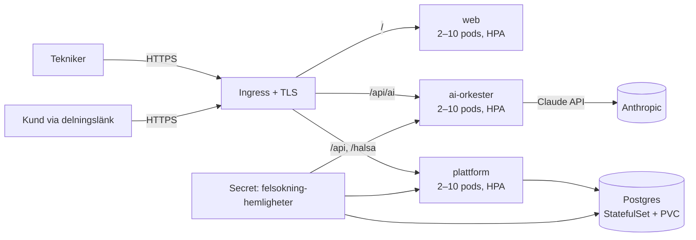

# Guidad Felsökning – Drift i Kubernetes (helt självhostat)

Målarkitekturen ur [Master Prompt](MASTER-PROMPT.md) som kod: hela stacken körbar i eget kluster — webb, AI-orkester, plattformsbackend (auth + händelse-API + Live Share) och Postgres. Inga externa tjänstberoenden utöver Anthropic-API:et för AI-anropen.

## Arkitektur



| Komponent | Vad | Var |
| --- | --- | --- |
| `web` | SPA:n bakom oprivilegierad nginx (`Dockerfile`, `docker/nginx.conf`) | Deployment + Service + HPA + PDB |
| `plattform` | Självhostad backend (`services/plattform`): inloggning (bcrypt via pgcrypto, HS256-JWT), append-only händelse-API för synken, publik delningsendpoint för Live Share | Deployment + Service + HPA + PDB |
| `ai-orkester` | AI-orkestern (`services/ai-orkester`): fyra uppgifter routade till Sonnet 5 / Opus 5 / Haiku 4.5 — verifierar plattformens JWT (delad hemlighet) | Deployment + Service + HPA + PDB |
| `postgres` | Händelselogg + användare; **append-only garanterat med databastriggers** — historik kan inte ändras eller raderas oavsett roll | StatefulSet + PVC (10 Gi). Produktion: CloudNativePG-operatorn för backup/failover/PITR |
| Hemligheter | `anthropic-api-key`, `jwt-secret` (delas av plattform + orkester), `postgres-losenord` | Secret `felsokning-hemligheter` — aldrig i bilder eller manifest |

**Klienten har två driftlägen**, valda vid bygget: med `VITE_PLATTFORM_URL` går inloggning, synk, Live Share och AI mot klustret (helt självhostat); utan den används Supabase-läget (edge-funktion + managerad Postgres/Auth) som tidigare. Samma händelsemodell, samma orkester — låst av paritetstester.

## Driftsätta

```sh
# 1. Bygg och publicera bilderna (ersätt registry i infra/k8s/*.yaml)
docker build -t ghcr.io/ORG/guidad-felsokning-web \
  --build-arg VITE_PLATTFORM_URL=https://app.exempel.se .
docker build -t ghcr.io/ORG/guidad-felsokning-ai-orkester services/ai-orkester
docker build -t ghcr.io/ORG/guidad-felsokning-plattform services/plattform
docker push ghcr.io/ORG/guidad-felsokning-web
docker push ghcr.io/ORG/guidad-felsokning-ai-orkester
docker push ghcr.io/ORG/guidad-felsokning-plattform

# 2. Skapa secret:en (eller använd External Secrets/Sealed Secrets)
kubectl create namespace guidad-felsokning
kubectl -n guidad-felsokning create secret generic felsokning-hemligheter \
  --from-literal=anthropic-api-key='sk-ant-…' \
  --from-literal=jwt-secret="$(openssl rand -base64 48)" \
  --from-literal=postgres-losenord="$(openssl rand -base64 24)"

# 3. Applicera manifesten (Postgres initieras med schema + append-only-triggers)
kubectl apply -k infra/k8s

# 4. Verifiera
kubectl -n guidad-felsokning get pods
curl https://app.exempel.se/halsa       # → {"status":"ok"} (plattformen)
```

Byt domän och cert-issuer i `infra/k8s/ingress.yaml`. Självregistrering är öppen i beta — stäng med `REGISTRERING_OPPEN=false` på plattformens Deployment när organisationsstyrd användarhantering införs.

## Säkerhet och robusthet

- **Append-only i tre lager:** klienten lägger bara till, API:t exponerar inga update/delete, och databastriggers avvisar ändringar även för en felkonfigurerad roll.
- **JWT-flödet är verifierat tvärs tjänsterna:** plattformen signerar, orkestern verifierar samma hemlighet; fel hemlighet och utgångna tokens avvisas (testat).
- Alla containrar kör **non-root** utan capabilities; backend-tjänsterna med read-only rotfilsystem. Båda failar closed utan sina hemligheter.
- **HPA** 2–10 pods per tjänst på 70 % CPU; **PDB** minst en pod uppe vid noddränering; readiness/liveness-prober överallt (`pg_isready` för Postgres).

## CI

`.github/workflows/ci.yml` kör tester + produktionsbygge och verifierar alla tre Dockerfilerna på varje push/PR. Publicering och `kubectl apply` läggs i ett separat behörighetsstyrt deploy-flöde (GitOps via Argo CD/Flux rekommenderas).
