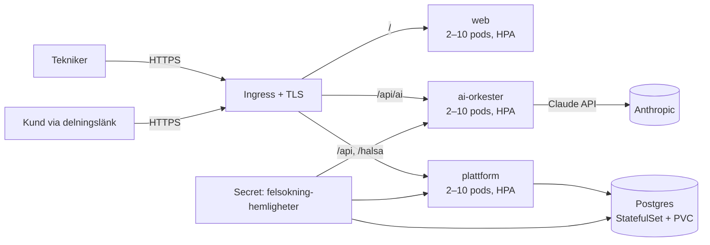
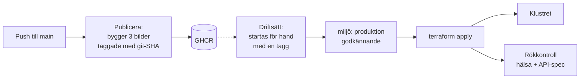

# Guidad Felsökning – Drift i Kubernetes (helt självhostat)

Målarkitekturen ur [Master Prompt](MASTER-PROMPT.md) som kod: hela stacken körbar i eget kluster — webb, AI-orkester, plattformsbackend (auth + händelse-API + Live Share) och Postgres. Inga externa tjänstberoenden utöver Anthropic-API:et för AI-anropen.

## Arkitektur



| Komponent | Vad | Var |
| --- | --- | --- |
| `web` | SPA:n bakom oprivilegierad nginx (`Dockerfile`, `docker/nginx.conf`) | Deployment + Service + HPA + PDB |
| `plattform` | Självhostad backend (`services/plattform`): **multi-tenant** — registrering skapar organisation + systemadministratör, admin hanterar användare (tekniker/arbetsledare/admin), all ärendedata organisationsisolerad. Inloggning (bcrypt via pgcrypto, HS256-JWT med roll + org i anspråken), append-only händelse-API, publik delningsendpoint | Deployment + Service + HPA + PDB |
| `ai-orkester` | AI-orkestern (`services/ai-orkester`): fyra uppgifter routade till Sonnet 5 / Opus 5 / Haiku 4.5 — verifierar plattformens JWT (delad hemlighet) | Deployment + Service + HPA + PDB |
| `postgres` | Händelselogg + användare; **append-only garanterat med databastriggers** — historik kan inte ändras eller raderas oavsett roll | Tre lägen: extern managerad Postgres (rekommenderat), CloudNativePG i klustret, eller en enkel StatefulSet utan backup för prov |
| Hemligheter | `anthropic-api-key`, `jwt-secret` (delas av plattform + orkester), `postgres-losenord`, `integration-nyckel` (krypterar kundernas märkesspecifika credentials) |
| Miljöflaggor | `TILLATNA_URSPRUNG` (CORS-lista; utelämnad = `*`), `TILLAT_INTERNA_UPPSLAG` (`true` tillåter leverantörsuppslag mot privata nät), `REGISTRERING_OPPEN`, `ECM_REGLER_FIL`, `INTEGRATIONER_FIL` | Secret `felsokning-hemligheter` — aldrig i bilder eller manifest |

**Klienten har två driftlägen**, valda vid bygget: med `VITE_PLATTFORM_URL` går inloggning, synk, Live Share och AI mot klustret (helt självhostat); utan den används Supabase-läget (edge-funktion + managerad Postgres/Auth) som tidigare. Samma händelsemodell, samma orkester — låst av paritetstester.

## Infrastrukturen som kod

`infra/terraform` är systemets definition — läs [README:n där](../infra/terraform/README.md).
Börja i `karta.tf`: hela systemet beskrivet en gång som data (tjänster,
portar, routing, hemligheter, dataflöden, gränser). `terraform output
karta` skriver ut samma sak i klartext.

Definitionen omfattar hemligheter, databasschema, nätverksgränser och
alla tre databaslägena. Kustomize- och Argo CD-vägen är borttagen —
`infra/postgres-init.sql` är det enda som blivit kvar utanför Terraform,
och den läses av både Terraform och integrationstestet så att schemat
inte kan glida isär från det som testas.

## Nätverksgränser

Terraform-vägen stänger namnrymden och öppnar bara de faktiska flödena:

| Från | Till | Varför |
| --- | --- | --- |
| ingress-kontrollern | web, plattform, ai-orkester :8080 | den enda vägen in |
| plattform | postgres :5432 | händelseloggen |
| plattform | internet :443 utom privata nät | kundernas leverantörer |
| ai-orkester | internet :443 utom privata nät | Claude |
| web, postgres | — | ringer ingenting |

Undantagen för privata nät (10/8, 172.16/12, 192.168/16, 169.254/16,
127/8, 100.64/10) är samma gräns som koden själv upprätthåller i
`pekarInat` — två oberoende spärrar mot att ett kundkonfigurerat uppslag
används för att nå klustrets insida eller molnets metadatatjänst.
Kräver en CNI som tillämpar NetworkPolicy; annars är reglerna
dokumentation, inte skydd.

## Driftsätta

Allt går genom Terraform — hemligheter, schema och nätverksgränser
ingår. Det finns ingen `kubectl apply` att komma ihåg.

```sh
cd infra/terraform
cp terraform.tfvars.exempel terraform.tfvars   # domän, register, databasläge, nycklar
terraform init
terraform plan
terraform apply -var bildtagg=<git-sha>

terraform output karta       # hela systemet i klartext
terraform output endpoints   # adresser att kontrollera
```

Sedan:

```sh
curl https://app.exempel.se/halsa            # → {"status":"ok"}
curl https://app.exempel.se/api/openapi.yaml # hela API-specen
```

Klustret behöver: en CNI som tillämpar NetworkPolicy, ingress-nginx,
cert-manager, en metrics-server och en StorageClass med ReadWriteOnce.

Att skapa nya organisationer är stängt som standard
(`registrering_oppen = false`); användare inom en organisation skapas
alltid av dess systemadministratör.

## Databasen: valet som avgör om det finns backup

`databas_lage` saknar standardvärde med flit.

| Läge | Backup | Failover | Använd när |
| --- | --- | --- | --- |
| `extern` | Leverantörens, med PITR | Leverantörens | **Produktion.** Cloud SQL, RDS, Neon, Azure |
| `cnpg` | Basbackup 02:30 + WAL-arkiv → objektlagring, PITR | Ja | Produktion när databasen måste ligga i klustret |
| `inbyggd` | **Ingen** | Nej | Prov och demo — spärras när `miljo = "produktion"` |

Går händelseloggen förlorad är det inte "data" som försvinner utan varje
ärendes bevisvärde: vad som kontrollerades, av vem, när, med vilken
evidens. Det går inte att återskapa i efterhand.

`cnpg` kräver CloudNativePG-operatorn installerad först — Terraform slår
upp dess CRD redan vid plan. I `extern` läge kör ni
`infra/postgres-init.sql` mot databasen själva; det är samma fil som
integrationstestet kör.

## Åtkomst: spärr och återkallelse

En giltig JWT-signatur räcker inte. Varje autentiserat anrop slår upp
kontot och kontrollerar två saker till: att det fortfarande är aktivt och
att token-versionen stämmer. Det kostar ett uppslag på primärnyckeln per
anrop och ger i gengäld **omedelbar** återkallelse i stället för att en
avstängning börjar gälla först när token går ut om upp till tolv timmar.

| Situation | Väg | Effekt |
| --- | --- | --- |
| Någon slutar | `POST /api/anvandare/{id}/avaktivera` (admin) | Inloggning stängs och pågående sessioner upphör direkt |
| Kontot ska tillbaka | `POST /api/anvandare/{id}/aktivera` (admin) | Kan logga in igen; tidigare återkallade tokens förblir döda |
| Telefon borttappad | `POST /api/auth/logga-ut-alla` (sig själv) | Alla enheter loggas ut |

En administratör kan inte stänga av sig själv, och gränsen mellan
organisationer gäller — org B kan inte röra org A:s användare.
Händelseloggen rörs aldrig: historiken är fortfarande knuten till
personen som utförde arbetet.

**Takt-begränsning på inloggning** ligger i databasen, inte i minnet, så
spärren håller bakom flera repliker: 10 misslyckade försök per konto och
30 per källadress inom 15 minuter ger 429. Spärren gäller kontot även vid
rätt lösenord — annars kunde den kringgås av den som till slut gissar
rätt. Andra konton påverkas inte. Inget lösenord lagras, bara att ett
försök skedde och om det lyckades; rader äldre än ett dygn städas bort i
skrivvägen.

## Multi-tenant och roller

Enligt Master Prompt: varje kund är en egen tenant, ingen data blandas mellan kunder.

- **Registrering skapar organisationen** och gör användaren till systemadministratör.
- **Admin skapar användare** (tekniker/arbetsledare/admin) i sin organisation — via UI:t eller `POST /api/anvandare`.
- **All ärendedata är organisationsknuten**: ärenden skapas i användarens organisation och händelse-API:t verifierar organisationstillhörighet på varje anrop — en annan organisations ärenden ger 404.
- **Rollen ligger i JWT:n** och verifieras på servern; klienten anpassar bara UI:t.

Integrationstestet (`services/plattform/integrationstest.sh`, körs även i CI mot riktig Postgres) verifierar hela kedjan: registrering, synk, idempotens, append-only-triggern, organisationsisolering, delningsfiltrering och rollstyrning.

## Säkerhet och robusthet

- **Append-only i tre lager:** klienten lägger bara till, API:t exponerar inga update/delete, och databastriggers avvisar ändringar även för en felkonfigurerad roll.
- **JWT-flödet är verifierat tvärs tjänsterna:** plattformen signerar, orkestern verifierar samma hemlighet; fel hemlighet och utgångna tokens avvisas (testat).
- Alla containrar kör **non-root** utan capabilities; backend-tjänsterna med read-only rotfilsystem. Båda failar closed utan sina hemligheter.
- **HPA** 2–10 pods per tjänst på 70 % CPU; **PDB** minst en pod uppe vid noddränering; readiness/liveness-prober överallt (`pg_isready` för Postgres).

## CI/CD med GitOps

**CI** (`.github/workflows/ci.yml`): tester, produktionsbygge, integrationstest mot riktig Postgres och verifierande containerbyggen på varje push/PR.

**CD** — två flöden, medvetet åtskilda: en bild i registret är inte samma sak som en bild som kör.



1. **Publicera** vid varje main-push: bygger de tre bilderna och taggar med git-SHA:t (`GITHUB_TOKEN`, inga externa hemligheter).
2. **Driftsätt** startas för hand med en tagg, mot GitHub-miljön `produktion` som kan kräva godkännande. Kör `fmt`, `init`, `validate`, `plan`, `apply`, skriver ut kartan och rökkontrollerar hälsa och API-spec. `bara_plan` visar planen utan att applicera.
3. **Rollback** = kör Driftsätt igen med en tidigare tagg.

Kustomize- och Argo CD-vägen är borttagen. Den beskrev samma system en gång till och kunde inte köras samtidigt som Terraform utan att de motarbetade varandra — `selfHeal` återställde det Terraform ändrade och `prune` tog bort det Terraform skapade.

