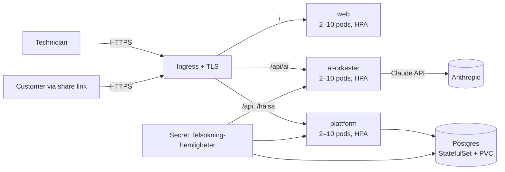
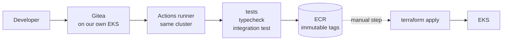

# Guidad Felsökning — operations on Kubernetes (fully self-hosted)

> Canonical version. Swedish: [OPERATIONS.sv.md](OPERATIONS.sv.md).
> Code identifiers, environment variables and file paths are Swedish and appear
> verbatim.

The target architecture from the [Master Prompt](MASTER-PROMPT.md) as code: the
whole stack runnable in our own cluster — web, orchestrator, platform backend
(auth + event API + Live Share) and Postgres. No external service dependencies
beyond the Anthropic API for the model calls.

## Architecture



| Component | What | Where |
| --- | --- | --- |
| `web` | The SPA behind unprivileged nginx (`Dockerfile`, `docker/nginx.conf`) | Deployment + Service + HPA + PDB |
| `plattform` | Self-hosted backend (`services/plattform`): **multi-tenant** — registration creates an organisation plus a system administrator, admins manage users (technician/supervisor/admin), all case data organisation-isolated. Login (bcrypt via pgcrypto, HS256 JWT with role and org in the claims), append-only event API, public share endpoint | Deployment + Service + HPA + PDB |
| `ai-orkester` | The orchestrator (`services/ai-orkester`): tasks routed to Sonnet 5 / Opus 5 / Haiku 4.5 — verifies the platform's JWT (shared secret) | Deployment + Service + HPA + PDB |
| `postgres` | Event log and users; **append-only guaranteed by database triggers** — history cannot be changed or deleted regardless of role | **Aurora PostgreSQL Serverless v2** outside the cluster, in a subnet layer with no route out. Automatic backup with PITR to the second |
| Secrets | `anthropic-api-key`, `jwt-secret` (shared by platform and orchestrator), `postgres-losenord`, `integration-nyckel` (encrypts the customers' brand-specific credentials) |
| Environment flags | `TILLATNA_URSPRUNG` (CORS list; omitted = `*`), `TILLAT_INTERNA_UPPSLAG` (`true` allows vendor lookups against private networks), `REGISTRERING_OPPEN`, `ECM_REGLER_FIL`, `INTEGRATIONER_FIL` | Secret `felsokning-hemligheter` — never in images or manifests |

**The client has two operating modes**, chosen at build time: with
`VITE_PLATTFORM_URL`, login, sync, Live Share and the model calls go to the
cluster (fully self-hosted); without it the Supabase mode is used (edge function
plus managed Postgres/Auth) as before. Same event model, same orchestrator —
locked by parity tests.

## Infrastructure as code

Two layers, in order:

| Layer | Where | What |
| --- | --- | --- |
| 1 | `infra/aws` | VPC, EKS, Aurora, S3, ECR, Secrets Manager, Route 53/ACM, CloudWatch |
| 2 | `infra/terraform` | The workload in the cluster — reads layer 1's outputs |

The split is not a matter of taste. A single apply that both creates an EKS
cluster and schedules into it is a known trap: the Kubernetes provider has to be
configured with details that do not exist until the cluster does.

Layer 2 decides almost nothing on its own — `05-aws.tf` reads the base's
outputs, so domain, registry, roles, certificate, bucket and secret names are
stated in exactly one place.

`terraform output karta` in either layer prints the whole truth in plain text,
straight from the definition.

## Network boundaries

The Terraform path closes the namespace and opens only the actual flows:

| From | To | Why |
| --- | --- | --- |
| the ingress controller | web, plattform, ai-orkester :8080 | the only way in |
| plattform | postgres :5432 | the event log |
| plattform | internet :443 except private networks | the customers' vendors |
| ai-orkester | internet :443 except private networks | Claude |
| web, postgres | — | call nothing |

The exceptions for private networks (10/8, 172.16/12, 192.168/16, 169.254/16,
127/8, 100.64/10) are the same boundary the code itself enforces in `pekarInat`
— two independent barriers against a customer-configured lookup being used to
reach the cluster's interior or the cloud metadata service. Requires a CNI that
enforces NetworkPolicy; otherwise the rules are documentation, not protection.

## Deploying

```sh
# Layer 1 — the AWS base
cd infra/aws
cp terraform.tfvars.exempel terraform.tfvars   # domain, region, alarm address
terraform init && terraform apply
terraform output karta

# Layer 2 — the workload
cd ../terraform
cp terraform.tfvars.exempel terraform.tfvars   # state bucket and image tag
terraform init && terraform apply -var bildtagg=<commit-sha>
```

After the first apply, three things remain, listed by `terraform output karta`
under `kvar_att_gora` (still to do): fill in the Claude key in Secrets Manager,
run `infra/postgres-init.sql` against Aurora, and narrow
`tillatna_api_cidr` from `0.0.0.0/0`.

Creating new organisations is closed by default (`registrering_oppen = false`);
users within an organisation are always created by its system administrator.

## The database

Aurora PostgreSQL Serverless v2, outside the cluster, in a subnet layer **with
no route out at all** — the database's inability to reach the internet therefore
does not depend on a security group being configured correctly.

Automatic backup with PITR to the second within the retention window. If the
event log is lost, what disappears is not "data" but every case's probative
value: what was checked, by whom, when, with what evidence. That cannot be
recreated afterwards.

The schema with the append-only triggers is
`infra/postgres-init.sql` — the same file the integration test runs,
so they cannot drift apart.

## Secrets

AWS Secrets Manager is the source of truth. External Secrets mirrors them into
the cluster every hour, and the pods read them as ordinary environment
variables.

**Terraform never sees the values**, and that is the whole point: a secret that
passes through Terraform ends up in the state file. When a secret is rotated,
the cluster follows on its own within the hour.

Access goes via IRSA: the platform's service account has a role bound to exactly
that account in that namespace. The neighbouring pod on the same node gets
nothing for free, and IMDSv2 with hop limit 1 stops a pod from borrowing the
node's role via the metadata service. The same role signs against S3 — no keys
exist to leak.

## Attachments

Photos, video clips and instrument images used to sit as data URLs inside the
events. That affected everything that reads the log: sync dragged the entire
image payload along every fifteen seconds, the customer view likewise, and a
backup of the log was in practice a copy of every photo.

Now the content lives outside the event and the log carries a reference with the
content's SHA-256. **That strengthens the probative value rather than weakening
it**: the hash sits in the append-only-protected log, so an image that has been
swapped can be detected — previously the image sat in the log and simply had to
be taken on trust. The content is checked against the hash every time it is
served; if it does not match, the service answers 409 instead of showing the
image.

Content-addressed, so the same photo documented twice is stored once.

| `bilage_lage` | Where the content lives | Use when |
| --- | --- | --- |
| `databas` (default) | `bilage_innehall` (bytea) | Works everywhere with no configuration; the images travel with the database backups |
| `s3` | S3-compatible object storage (AWS, MinIO, Ceph) | The log and the images should grow independently of each other |

The signing against object storage is our own (SigV4 for PUT and GET) rather
than the cloud provider's SDK — two operations do not justify tens of megabytes
of dependencies. It is cross-verified against botocore in the tests, bit for
bit.

**The sharing boundary applies to attachments too.** An attachment can be
fetched through a share link only if the event it belongs to is visible at that
level; the scanned work order is therefore never reachable through the customer
link.

Older events with an embedded data URL keep working and always will — the log is
append-only. Local mode, without login, also embeds: there is no server to
upload to, and the documentation must not be lost because the network is down.

## Access: blocking and revocation

A valid JWT signature is not enough. Every authenticated call looks up the
account and checks two further things: that it is still active, and that the
token version matches. It costs one primary-key lookup per call and in return
gives **immediate** revocation, instead of a suspension taking effect only when
the token expires up to twelve hours later.

| Situation | Route | Effect |
| --- | --- | --- |
| Someone leaves | `POST /api/anvandare/{id}/avaktivera` (admin) | Login is closed and ongoing sessions end immediately |
| The account should come back | `POST /api/anvandare/{id}/aktivera` (admin) | Can log in again; previously revoked tokens stay dead |
| Phone lost | `POST /api/auth/logga-ut-alla` (oneself) | All devices are logged out |

An administrator cannot disable themselves, and the boundary between
organisations holds — org B cannot touch org A's users. The event log is never
touched: the history is still tied to the person who did the work.

**Login rate limiting** lives in the database, not in memory, so the block holds
behind several replicas: 10 failed attempts per account and 30 per source
address within 15 minutes give a 429. The block applies to the account even on a
correct password — otherwise it could be bypassed by whoever eventually guesses
right. Other accounts are unaffected. No password is stored, only that an
attempt happened and whether it succeeded; rows older than a day are cleaned up
on the write path.

## Observability

The services deliberately have almost no dependencies. Pulling in an
OpenTelemetry SDK with thirty packages to measure four things would be the wrong
trade, so observability rests on two standards that are both just text on
stdout:

**W3C Trace Context.** The client starts the trace and `traceparent` travels
through the platform to the orchestrator. A technician's action can therefore be
followed all the way to the model's answer, instead of becoming two unrelated
traces.

**CloudWatch EMF.** Structured JSON from which CloudWatch itself extracts
metrics — no agent, no SDK, nothing that can silently stop working.

Every call produces a log line with a **breakdown of the time**:

```json
{"nivå":"info","meddelande":"plattform","spårId":"fd5dec…","väg":"/api/arenden/:id/handelser",
 "status":200,"ms":842.1,"delar":{"databas":{"antal":3,"ms":31.2},"bilaga_skriv":{"antal":1,"ms":780.4}}}
```

That answers the question you actually have at three in the morning: *where did
the time go*. Here in object storage, not in the database.

### The route is always normalised

The route is normalised (`/api/arenden/:id/handelser`) before it becomes a
dimension. Organisation, case id and trace id **never** become dimensions —
every unique combination is its own time series that costs money. They sit as
ordinary fields, searchable in Logs Insights. A test locks this.

### Queries that tend to be needed

```
# Where did the time go on a slow call?
fields tid, väg, ms, delar.databas.ms, delar.modell_handledning.ms, spårId
| filter ms > 1000 | sort ms desc | limit 20

# The whole chain for one trace — platform and orchestrator in the same view
fields tid, meddelande, väg, ms, status | filter spårId = "fd5dec…" | sort tid

# Which model calls cost the most?
stats sum(ut) as ut_tokens, avg(ms) as snitt by Uppgift, Modell
```

### Alarms

Beyond the infrastructure alarms there are three on the application's own
metrics: response time **p95** above three seconds (the mean hides that every
twentieth technician waits unreasonably long), server errors, and the model
declining — the last of which indicates that the input contains something
unexpected, not an operational fault.

## Multi-tenancy and roles

Per the Master Prompt: each customer is its own tenant, no data is mixed between
customers.

- **Registration creates the organisation** and makes the user its system
  administrator.
- **Admins create users** (technician/supervisor/admin) in their organisation —
  through the UI or `POST /api/anvandare`.
- **All case data is organisation-scoped**: cases are created in the user's
  organisation and the event API verifies organisation membership on every call
  — another organisation's cases give a 404.
- **The role lives in the JWT** and is verified on the server; the client only
  adapts the UI.

The integration test (`services/plattform/integrationstest.sh`, also run in CI
against real Postgres) verifies the whole chain: registration, sync, idempotency,
the append-only trigger, organisation isolation, share filtering and role
enforcement.

## Security and robustness

- **Append-only in three layers:** the client only appends, the API exposes no
  update or delete, and database triggers reject changes even for a
  misconfigured role.
- **The JWT flow is verified across the services:** the platform signs, the
  orchestrator verifies the same secret; a wrong secret and expired tokens are
  rejected (tested).
- All containers run **non-root** without capabilities; the backend services
  with a read-only root filesystem. Both fail closed without their secrets.
- **HPA** 2–10 pods per service at 70 % CPU; **PDB** keeps at least one pod up
  during node drain; readiness and liveness probes everywhere (`pg_isready` for
  Postgres).

## CI/CD with GitOps

**CI** (`.gitea/workflows/felsokning.yml`): tests, production build, integration
test against real Postgres and verifying container builds on every push and PR.

**CD** — all our own, no GitHub. Source code, build, registry and operations
live in our AWS environment.



1. **Gitea** runs in the cluster with its own Actions runners. The workflow
   syntax is the same as GitHub Actions, so `.gitea/workflows/felsokning.yml` is
   the same file that used to sit under `.github` — just moved.
2. **The build** publishes to ECR with immutable tags: a tag that has pointed at
   one build cannot point at another, so "which code is running in production"
   has an unambiguous answer.
3. **Deployment** is a separate, manual step with an image tag. An image in the
   registry is not the same thing as an image that is running. Rollback = run
   again with the previous tag.
4. **Split permissions:** the build role may publish to ECR but not touch the
   cluster; the operations role the other way round. A compromised build cannot
   deploy.

`.github/workflows/ci.yml` belongs to Semantika and is not touched.
