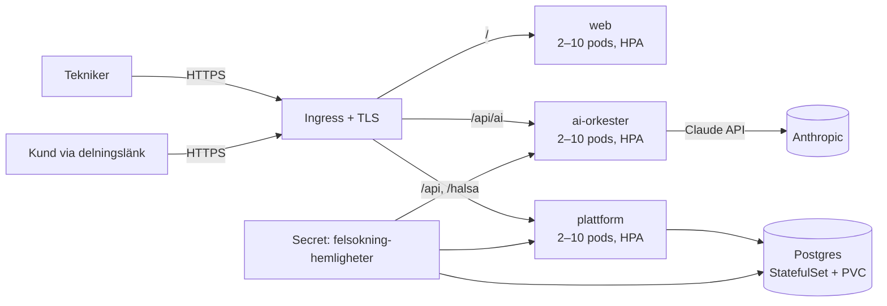
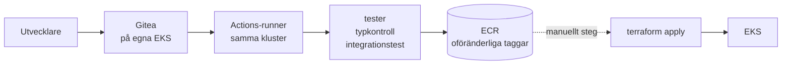

# Guidad Felsökning – Drift i Kubernetes (helt självhostat)

Målarkitekturen ur [Master Prompt](MASTER-PROMPT.md) som kod: hela stacken körbar i eget kluster — webb, AI-orkester, plattformsbackend (auth + händelse-API + Live Share) och Postgres. Inga externa tjänstberoenden utöver Anthropic-API:et för AI-anropen.

## Arkitektur



| Komponent | Vad | Var |
| --- | --- | --- |
| `web` | SPA:n bakom oprivilegierad nginx (`Dockerfile`, `docker/nginx.conf`) | Deployment + Service + HPA + PDB |
| `plattform` | Självhostad backend (`services/plattform`): **multi-tenant** — registrering skapar organisation + systemadministratör, admin hanterar användare (tekniker/arbetsledare/admin), all ärendedata organisationsisolerad. Inloggning (bcrypt via pgcrypto, HS256-JWT med roll + org i anspråken), append-only händelse-API, publik delningsendpoint | Deployment + Service + HPA + PDB |
| `ai-orkester` | AI-orkestern (`services/ai-orkester`): fyra uppgifter routade till Sonnet 5 / Opus 5 / Haiku 4.5 — verifierar plattformens JWT (delad hemlighet) | Deployment + Service + HPA + PDB |
| `postgres` | Händelselogg + användare; **append-only garanterat med databastriggers** — historik kan inte ändras eller raderas oavsett roll | **Aurora PostgreSQL Serverless v2** utanför klustret, i ett subnätlager utan routing ut. Automatisk säkerhetskopiering med PITR ned till sekunden |
| Hemligheter | `anthropic-api-key`, `jwt-secret` (delas av plattform + orkester), `postgres-losenord`, `integration-nyckel` (krypterar kundernas märkesspecifika credentials) |
| Miljöflaggor | `TILLATNA_URSPRUNG` (CORS-lista; utelämnad = `*`), `TILLAT_INTERNA_UPPSLAG` (`true` tillåter leverantörsuppslag mot privata nät), `REGISTRERING_OPPEN`, `ECM_REGLER_FIL`, `INTEGRATIONER_FIL` | Secret `felsokning-hemligheter` — aldrig i bilder eller manifest |

**Klienten har två driftlägen**, valda vid bygget: med `VITE_PLATTFORM_URL` går inloggning, synk, Live Share och AI mot klustret (helt självhostat); utan den används Supabase-läget (edge-funktion + managerad Postgres/Auth) som tidigare. Samma händelsemodell, samma orkester — låst av paritetstester.

## Infrastrukturen som kod

Två lager, i ordning:

| Lager | Var | Vad |
| --- | --- | --- |
| 1 | `felsokning/infra/aws` | VPC, EKS, Aurora, S3, ECR, Secrets Manager, Route 53/ACM, CloudWatch |
| 2 | `felsokning/infra/terraform` | Arbetslasten i klustret — läser lager 1:s utdata |

Uppdelningen är inte smak. En enda apply som både skapar ett EKS-kluster
och schemalägger in i det är en känd fälla: kubernetes-leverantören måste
konfigureras med uppgifter som inte finns förrän klustret existerar.

Lager 2 bestämmer nästan ingenting själv — `05-aws.tf` läser basens
utdata, så domän, register, roller, certifikat, hink och hemligheternas
namn anges bara på ett ställe.

`terraform output karta` i vardera lagret skriver ut hela sanningen i
klartext, direkt ur definitionen.

## Nätverksgränser

Terraform-vägen stänger namnrymden och öppnar bara de faktiska flödena:

| Från | Till | Varför |
| --- | --- | --- |
| ingress-kontrollern | web, plattform, ai-orkester :8080 | den enda vägen in |
| plattform | postgres :5432 | händelseloggen |
| plattform | internet :443 utom privata nät | kundernas leverantörer |
| ai-orkester | internet :443 utom privata nät | Claude |
| web, postgres | — | ringer ingenting |

Undantagen för privata nät (10/8, 172.16/12, 192.168/16, 169.254/16,
127/8, 100.64/10) är samma gräns som koden själv upprätthåller i
`pekarInat` — två oberoende spärrar mot att ett kundkonfigurerat uppslag
används för att nå klustrets insida eller molnets metadatatjänst.
Kräver en CNI som tillämpar NetworkPolicy; annars är reglerna
dokumentation, inte skydd.

## Driftsätta

```sh
# Lager 1 — AWS-basen
cd felsokning/infra/aws
cp terraform.tfvars.exempel terraform.tfvars   # domän, region, larmadress
terraform init && terraform apply
terraform output karta

# Lager 2 — arbetslasten
cd ../terraform
cp terraform.tfvars.exempel terraform.tfvars   # tillståndshink och bildtagg
terraform init && terraform apply -var bildtagg=<commit-sha>
```

Efter första apply återstår tre saker som `terraform output karta`
listar under `kvar_att_gora`: fyll i Claude-nyckeln i Secrets Manager,
kör `felsokning/infra/postgres-init.sql` mot Aurora, och snäva in
`tillatna_api_cidr` från `0.0.0.0/0`.

Att skapa nya organisationer är stängt som standard
(`registrering_oppen = false`); användare inom en organisation skapas
alltid av dess systemadministratör.

## Databasen

Aurora PostgreSQL Serverless v2, utanför klustret, i ett subnätlager
**utan routing ut alls** — att databasen inte kan nå internet hänger
alltså inte på att en säkerhetsgrupp är rätt konfigurerad.

Automatisk säkerhetskopiering med PITR ned till sekunden inom
retentionsfönstret. Går händelseloggen förlorad är det inte "data" som
försvinner utan varje ärendes bevisvärde: vad som kontrollerades, av vem,
när, med vilken evidens. Det går inte att återskapa i efterhand.

Schemat med append-only-triggarna är `felsokning/infra/postgres-init.sql`
— samma fil som integrationstestet kör, så de kan inte glida isär.

## Hemligheter

AWS Secrets Manager är sanningskällan. External Secrets speglar in dem i
klustret var timme, och podarna läser dem som vanliga miljövariabler.

**Terraform ser aldrig värdena**, och det är själva poängen: en hemlighet
som passerar Terraform hamnar i tillståndsfilen. Roteras en hemlighet
följer klustret efter av sig självt inom en timme.

Åtkomsten går via IRSA: plattformens tjänstekonto har en roll bunden till
exakt det kontot i den namnrymden. Grannpodden på samma nod får ingenting
på köpet, och IMDSv2 med hoppgräns 1 hindrar en pod från att låna nodens
roll via metadatatjänsten. Samma roll signerar mot S3 — inga nycklar
existerar att läcka.

## Bilagor

Foton, videoklipp och instrumentbilder låg tidigare som data-URL:er inne
i händelserna. Det drabbade allt som läser loggen: synken drog med hela
bildmassan var femtonde sekund, kundvyn likaså, och en säkerhetskopia av
loggen var i praktiken en kopia av alla foton.

Nu ligger innehållet utanför händelsen och loggen bär en referens med
innehållets SHA-256. **Det stärker bevisvärdet i stället för att försvaga
det**: hashen står i den append-only-skyddade loggen, så en bild som
bytts ut går att upptäcka — tidigare låg bilden i loggen och måste helt
enkelt tros på. Innehållet kontrolleras mot hashen varje gång det lämnas
ut; stämmer det inte svarar tjänsten 409 i stället för att visa bilden.

Innehållsadresserat, så samma foto som dokumenteras två gånger lagras en
gång.

| `bilage_lage` | Var innehållet ligger | Använd när |
| --- | --- | --- |
| `databas` (standard) | `bilage_innehall` (bytea) | Fungerar överallt utan konfiguration; bilderna följer med databasens säkerhetskopior |
| `s3` | S3-kompatibel objektlagring (AWS, MinIO, Ceph) | Loggen och bilderna ska växa oberoende av varandra |

Signeringen mot objektlagringen är egen (SigV4 för PUT och GET) i stället
för molnleverantörens SDK — två operationer motiverar inte tiotals
megabyte beroenden. Den korsverifieras mot botocore i testerna, bit för
bit.

**Delningsgränsen gäller även bilagor.** En bilaga kan bara hämtas via en
delningslänk om händelsen den hör till är synlig på den nivån; den
skannade arbetsordern nås alltså aldrig via kundlänken.

Äldre händelser med inbäddad data-URL fortsätter att fungera och kommer
alltid att göra det — loggen är append-only. Lokalt läge, utan
inloggning, bäddar också in: det finns ingen server att ladda upp till,
och dokumentationen får inte gå förlorad för att nätet ligger nere.

## Åtkomst: spärr och återkallelse

En giltig JWT-signatur räcker inte. Varje autentiserat anrop slår upp
kontot och kontrollerar två saker till: att det fortfarande är aktivt och
att token-versionen stämmer. Det kostar ett uppslag på primärnyckeln per
anrop och ger i gengäld **omedelbar** återkallelse i stället för att en
avstängning börjar gälla först när token går ut om upp till tolv timmar.

| Situation | Väg | Effekt |
| --- | --- | --- |
| Någon slutar | `POST /api/anvandare/{id}/avaktivera` (admin) | Inloggning stängs och pågående sessioner upphör direkt |
| Kontot ska tillbaka | `POST /api/anvandare/{id}/aktivera` (admin) | Kan logga in igen; tidigare återkallade tokens förblir döda |
| Telefon borttappad | `POST /api/auth/logga-ut-alla` (sig själv) | Alla enheter loggas ut |

En administratör kan inte stänga av sig själv, och gränsen mellan
organisationer gäller — org B kan inte röra org A:s användare.
Händelseloggen rörs aldrig: historiken är fortfarande knuten till
personen som utförde arbetet.

**Takt-begränsning på inloggning** ligger i databasen, inte i minnet, så
spärren håller bakom flera repliker: 10 misslyckade försök per konto och
30 per källadress inom 15 minuter ger 429. Spärren gäller kontot även vid
rätt lösenord — annars kunde den kringgås av den som till slut gissar
rätt. Andra konton påverkas inte. Inget lösenord lagras, bara att ett
försök skedde och om det lyckades; rader äldre än ett dygn städas bort i
skrivvägen.

## Multi-tenant och roller

Enligt Master Prompt: varje kund är en egen tenant, ingen data blandas mellan kunder.

- **Registrering skapar organisationen** och gör användaren till systemadministratör.
- **Admin skapar användare** (tekniker/arbetsledare/admin) i sin organisation — via UI:t eller `POST /api/anvandare`.
- **All ärendedata är organisationsknuten**: ärenden skapas i användarens organisation och händelse-API:t verifierar organisationstillhörighet på varje anrop — en annan organisations ärenden ger 404.
- **Rollen ligger i JWT:n** och verifieras på servern; klienten anpassar bara UI:t.

Integrationstestet (`services/plattform/integrationstest.sh`, körs även i CI mot riktig Postgres) verifierar hela kedjan: registrering, synk, idempotens, append-only-triggern, organisationsisolering, delningsfiltrering och rollstyrning.

## Säkerhet och robusthet

- **Append-only i tre lager:** klienten lägger bara till, API:t exponerar inga update/delete, och databastriggers avvisar ändringar även för en felkonfigurerad roll.
- **JWT-flödet är verifierat tvärs tjänsterna:** plattformen signerar, orkestern verifierar samma hemlighet; fel hemlighet och utgångna tokens avvisas (testat).
- Alla containrar kör **non-root** utan capabilities; backend-tjänsterna med read-only rotfilsystem. Båda failar closed utan sina hemligheter.
- **HPA** 2–10 pods per tjänst på 70 % CPU; **PDB** minst en pod uppe vid noddränering; readiness/liveness-prober överallt (`pg_isready` för Postgres).

## CI/CD med GitOps

**CI** (`.github/workflows/ci.yml`): tester, produktionsbygge, integrationstest mot riktig Postgres och verifierande containerbyggen på varje push/PR.

**CD** — allt eget, inget GitHub. Källkod, bygge, register och drift ligger i vår AWS-miljö.



1. **Gitea** kör i klustret med egna Actions-runners. Workflow-syntaxen är densamma som GitHub Actions, så `.gitea/workflows/felsokning.yml` är samma fil som tidigare låg under `.github` — bara flyttad.
2. **Bygget** publicerar till ECR med oföränderliga taggar: en tagg som pekat på ett bygge kan inte peka på ett annat, så "vilken kod kör i produktion" har ett entydigt svar.
3. **Driftsättningen** är ett eget, manuellt steg med en bildtagg. En bild i registret är inte samma sak som en bild som kör. Rollback = kör igen med tidigare tagg.
4. **Delade rättigheter:** byggrollen får publicera till ECR men inte röra klustret; driftrollen tvärtom. Ett komprometterat bygge kan inte driftsätta.

`.github/workflows/ci.yml` tillhör Semantika och rörs inte.

